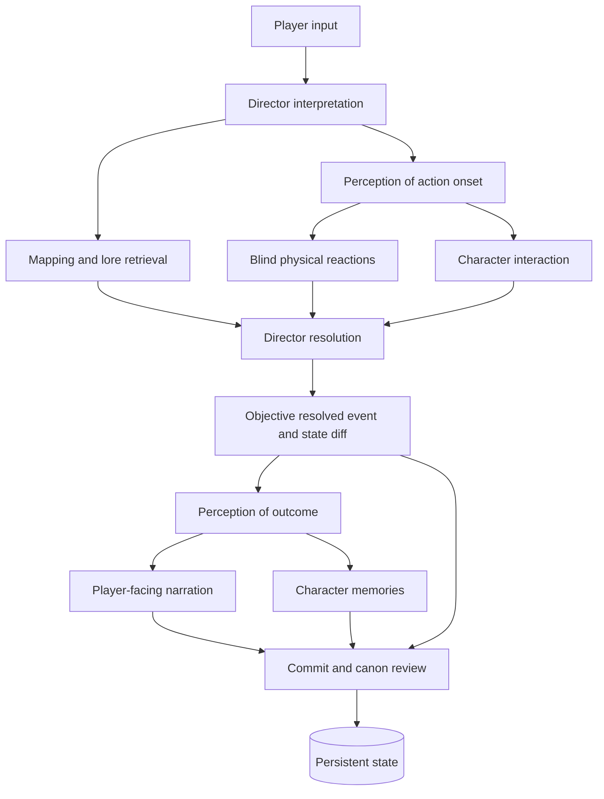

# Sonder Engine Design

## Multi-Agent Sonder Engine — Current Architecture and Product Philosophy

**Document status:** Living architecture specification
**Revision date:** July 19, 2026
**Purpose:** Define the engine’s philosophy, current behavior, invariants, implemented capabilities, known weaknesses, and development priorities.

## Product thesis

The Sonder Engine produces interactive fiction by maintaining a persistent world, routing information through explicit epistemic boundaries, and allowing independently modeled characters to act from their own perceptions, memories, relationships, knowledge, and beliefs.

Story is not generated from a single omniscient conversation context. It emerges from a pipeline that separately determines:

- What the player declared.
- What information is relevant to the current situation.
- What each character could perceive.
- What each character chooses to do.
- What objectively happens.
- What each observer experiences afterward.
- What the player is told.
- What persists into world state, memory, and canon.

The engine’s defining goal is:

> Produce coherent interactive fiction without granting fictional minds access to information they did not legitimately perceive, learn, remember, or infer.

Epistemic integrity is necessary but not sufficient. The engine also treats causal, identity, temporal, authority, and transactional integrity as parts of coherence: correct information routing cannot rescue a world whose state only half-committed or whose representations disagree.

The engine does not attempt to eliminate omniscience entirely. Objective resolution requires privileged infrastructure. Instead, omniscience is moved outside the fictional world and assigned to narrowly defined systems:

- The Director may inspect objective state so it can resolve causality.
- Mapping may inspect canon so it can maintain world coherence.
- The user may inspect any layer through director tools.
- Fictional characters receive only their own legitimate cognitive contexts.
- The Narrator receives only the player-facing slice required to render prose.

This creates a deliberate asymmetry:

> Infrastructure may know the world. Characters may know only their experience of it.

## Core product principles

### Epistemic separation

Objective truth, perception, memory, inference, belief, and narration are different forms of information.

They must not be collapsed into a single context.

A character may:

- Witness an event.
- Hear an incomplete report.
- Recall an old experience.
- Infer a hidden motive.
- Believe something false.
- Revise that belief later.

None of these is equivalent to direct access to objective truth.

### Epistemic least privilege

Every agent receives only the information required for its role whenever practical.

The engine does not rely exclusively on instructions such as “pretend not to know this.” It attempts to prevent unavailable information from entering restricted contexts in the first place.

Privileged agents necessarily receive broad information, but their outputs and persistence authority must be constrained.

### Scoped omniscience

The Director and Mapping agents have extensive access, but different authority.

- The Director owns immediate objective causality.
- Mapping owns retrieval, world organization, and durable canon proposals.
- Neither owns a character’s private psychology.
- Neither directly determines what a character perceives.
- Neither directly writes player-facing narration.
- Model output does not persist merely because a model proposed it.

Their power is broad within a clearly defined domain.

### Structure over instruction

Important guarantees should be represented through:

- Information routing.
- Typed payloads.
- Restricted contexts.
- Deterministic spatial checks.
- Schema validation.
- Mutation validation.
- Transactions.
- Stable event identifiers.
- Checkpoints.
- Tests.

Prompts remain important, but prompts are behavioral contracts rather than complete security boundaries.

### Progressive concretization

The engine should establish only as much detail as current evidence requires.

An unexplained sound may remain an unexplained sound. It does not immediately need:

- A named source.
- A complete history.
- A hidden faction.
- A mechanic.
- A future plot role.

World details become more concrete when supported by:

- Player assertions.
- Existing canon.
- Resolved consequences.
- Direct observation.
- Necessary spatial generation.
- Validated world expansion.

### User-level dramatic irony

The user may inspect private NPC experiences, memories, appraisals, and beliefs without granting that information to the player character or other NPCs.

This is not a violation of the firewall. It is a supported director-level perspective.

The interface should distinguish:

- What the user knows.
- What the player character knows.
- What each NPC knows.
- What is objectively true.

A concrete instance of this exists today as a pair of read-only inspector feeds: a dramatic-irony feed surfaces every non-witnessed memory across the cast (heard, told, inferred, read) in one place, and a promise ledger surfaces every promise-category memory in chronological order. Neither claims to detect that a belief is actually false or that a promise was kept or broken — that judgment is deliberately left to whoever is reading, consistent with the firewall the rest of the engine enforces.

### Simulation before rendering

The Narrator does not determine what happened.

Objective resolution occurs before player-facing prose. The Narrator renders the player’s filtered experience and cannot independently create objective events or additional player conduct.

### Characters declare; the world resolves

Character agents determine:

- What they notice in their supplied view.
- How they appraise it.
- What they believe.
- What they attempt.
- What they say.
- Whether they remain silent.

They do not determine:

- Whether their action succeeds.
- What another character does.
- What another character thinks.
- What objectively happened.
- What the player perceives.

### Capture, do not gate

Generativity is preserved, then tracked — the structure is a ledger, not a cage. The model invents freely; deterministic reconciliation ensures what it invents reaches structured state rather than evaporating. Two seams enforce this. The interpret-side seam checks the player's raw declaration against the interpreted output: a place, object, or event the player asserted that the interpretation dropped is captured, or the interpretation is repaired, before it enters causality. The resolve-side seam checks the resolved prose against the structured diff: a persistent physical change the narration asserts but the diff omits is caught by category-aware, alias-aware coverage and repaired by the Director itself, or surfaced as a warning. Neither seam fabricates state from a heuristic — a wrongly invented fact is worse than a stale missing one — and both rely on omission detection rather than an unwinnable enumeration of world-event vocabulary.

### Persistence is earned

Not every agent should maintain a continuous internal history.

- Perception is stateless.
- The Narrator retains only limited prose context.
- The Director uses current structured state and a short causal buffer.
- Mapping maintains durable canon and world organization.
- Characters maintain continuous private state and memory.

Persistence belongs primarily to systems representing a continuing world or continuing mind.

### Auditability and recoverability

The engine is too complex to trust as an opaque generation call.

Important outputs should be:

- Structured.
- Stored by step.
- Versioned through variants.
- Inspectable.
- Rerollable.
- Editable.
- Event-linked.
- Recoverable through checkpoints.
- Marked stale when upstream assumptions change.

The user should be able to determine why a result occurred and where an incorrect assumption entered the pipeline.

## The information model

The engine maintains several related but distinct information layers.

| Layer | Meaning | Primary owner |
|---|---|---|
| Objective state | Rooms, entities, positions, conditions, time, resolved events | Director and commit system |
| Canon | Durable world facts, mechanics, places, histories, and knowledge | Mapping and lorebooks |
| Perception | Signals physically delivered to one observer | Perception layer |
| Character memory | What one character remembers experiencing, hearing, learning, or inferring | Character memory system |
| Character belief | Fallible hypotheses about entities, emotions, goals, traits, and identity | Character mind models |
| Relationships | Character-specific trust, familiarity, warmth, and fear | Character relationship graph |
| Player-facing prose | The player’s experience rendered as narrative | Narrator |
| Pipeline record | Intermediate structured outputs and alternatives | Steps and variants |
| User director view | Optional inspection of privileged and private layers | User interface |

Information is allowed to move between these layers only through defined transitions.



## Agent authority model

Every agent is defined by four questions:

1. What may it read?
2. What may it propose?
3. What may it decide?
4. What may it persist?

| Agent | Reads | Decides | Must not decide |
|---|---|---|---|
| Director Establish | Scenario, player persona, cast, physical lore, fiction model | Initial objective scene | Recognition, private psychology, player-facing narration |
| Director Interpret | Current scene, input, cast, abilities, recent causal context | Meaning of declaration and pipeline flow | Final outcome, NPC decisions, narration |
| Mapping Stage | Lore graph, current scene, input, scenario, public character context | Relevant lore and proposed expansion | Character psychology, action success, perception |
| Perception | Objective act or outcome, spatial relations, senses, attention | Which signals reach each observer | Intent, identity without evidence, causality, psychology |
| Character | Private view, memory, psychology, relationships, legitimate knowledge | That character’s next declaration and hypotheses | Objective success, other minds, hidden truth |
| Reaction Loop | Per-character action-onset views | Reactive attempts | Reaction success or objective outcome |
| Interaction Loop | Delivered local views and prior observable micro-beats | Conversational continuation and speaker order | Physical resolution |
| Director Resolve | Objective scene, player declaration, reactions, character declarations, mechanics, dice | Objective outcome and state diff | Character beliefs, memories, player-facing prose |
| Outcome Perception | Resolved event and observer channels | Per-observer experience of the outcome | Memory interpretation and narration |
| Narrator | Player view, player declaration, private voice setting, recent prose | Prose expression | Hidden facts, new player conduct, objective resolution |
| Mapping Commit | Resolved facts, narrator specifics, existing canon | Proposed durable lore operations | Retroactive replacement of the resolved event |
| Commit Code | Structured outputs and current database state | Whether and how mutations are persisted | Creative invention |

## Current turn lifecycle

### Opening turn

The opening scene uses a specialized establishment pipeline:

1. Mapping retrieves or generates relevant physical context.
2. Director Establish creates the objective initial scene.
3. Perception Establish creates views for the player and present characters.
4. Narrator renders the player’s opening view.
5. Commit stores the initial scene, lore, and memories.


The opening Director may establish:

- Rooms.
- Room adjacency.
- Doors and barriers.
- Entities.
- Vehicles and containers.
- Interior rooms.
- Actor positions.
- Attire.
- Posture and visible activity.
- Held objects.
- Sensory events.
- Initial simulation time.
- Fiction scale and causal frame.

Perception then determines which parts of that objective state are available to each observer.

### Normal turn

A normal turn follows this pipeline:

1. Director Interpret normalizes the player input.
2. Mapping performs either quick retrieval or full mapping.
3. Perception Act filters the player’s action onset.
4. Reaction Loop runs for contested physical actions when required.
5. Interaction Loop runs for eligible character responses.
6. Director Resolve collapses declarations into one objective outcome.
7. Perception Outcome creates observer-specific result views.
8. Narrator renders the player’s view.
9. Commit updates persistent state.

The plan is dynamic. Not every turn requires the same cost.

- Ordinary turns may use cached lore retrieval.
- Unknown rooms or mechanics trigger full Mapping.
- Contestable physical actions trigger reactions.
- Dialogue may continue through bounded conversational micro-beats.
- Silence and no-response outcomes are valid.
- Character call budgets limit autonomous expansion.

## Player authority

The current engine distinguishes between asserted actions and contestable actions.

### Contestable declaration

A contestable declaration initiates an attempt while leaving external effects unresolved.

Examples:

- “I try to take the key.”
- “I lunge toward Mara.”
- “I attempt to break the door.”
- “I aim at the fleeing rider.”

The declared motion or attempt begins, but reactions and circumstances may alter its result.

### Asserted declaration

An asserted declaration presents an effect as completed.

Examples:

- “I take the key.”
- “I stab Mara.”
- “The door collapses.”
- “Three hours pass.”

The current authority contract treats asserted effects as true and allows the Director to determine their consequences rather than whether they occurred.

### Required product improvement

This is stronger than the original design’s protagonist-action authority and should become configurable.

The existing schema already anticipates modes such as:

-`actor_only`
-`explicit_outcomes`
-`world_author`

The intended future behavior should be:

| Mode | Player controls |
|---|---|
| Actor-only | The protagonist’s attempts, speech, and immediate bodily conduct |
| Explicit outcomes | The protagonist’s declared completed effects |
| World author | External events, entities, time, and world assertions |

Until these modes are enforced, the product should clearly document that its default behavior grants broad authority to asserted player declarations.

## Physical reactions and conversational interaction

The current architecture distinguishes urgent physical reactions from ordinary conversational continuation.

### Physical reaction phase

Physical reactors:

- Receive only their filtered view of the action onset.
- Declare independently.
- Do not inspect other pending reactions.
- Produce attempts rather than guaranteed outcomes.
- Are resolved together by the Director.

This preserves blind simultaneous reaction.

### Interaction phase

Conversation is sequential because later speakers can legitimately hear earlier speakers.

The interaction loop:

- Selects an initial speaker.
- Runs that character from its private view and memory.
- Deterministically delivers observable speech and action.
- Selects an eligible next speaker.
- Stops on a natural boundary.

Stop conditions include:

- A question to the player.
- A physical act requiring Director resolution.
- Silence.
- No eligible respondent.
- Character-declared completion.
- Disabled NPC-to-NPC dialogue.
- Round or call-budget exhaustion.

This modifies the original all-parallel model in a useful way:

> Physical reactions remain blind and simultaneous; conversational micro-beats may be sequential when each later participant genuinely perceived the previous beat.

## Perception and the epistemic firewall

Perception is a stateless signal-filtering layer.

It runs:

- At scene establishment.
- Before reactions and character decisions.
- After objective resolution.

Perception receives privileged information because it must filter objective events. It may:

- Deliver a full signal.
- Deliver a degraded fragment.
- Remove an unavailable signal.
- Include local environmental awareness.
- Apply visual and auditory restrictions.
- Respect identity knowledge.
- Respect senses and attention.

It must not:

- Invent intent.
- Reveal hidden history.
- Identify an unknown actor without evidence.
- Convert a raw signal into a correct explanation.
- Reveal private thoughts.
- Contradict the objective event.
- Deliver information across a nonexistent channel.

### Deterministic spatial support

The engine currently enforces important parts of perception through code:

- Room lookup.
- Same-room detection.
- Adjacency.
- Open and closed barriers.
- Visual access.
- Speech attenuation.
- Visible adjacent rooms.
- Unknown spatial relationships failing closed.
- Deterministic injection of perceivable dialogue and overt actions.

The current system is best described as:

> Model-rendered perception constrained by deterministic spatial and delivery rules.

It is not yet a formal noninterference proof. Stronger post-generation validation remains a development goal.

## Character cognition

Each active NPC is represented by an independent character process.

A character receives:

- Its identity.
- Psychology.
- Voice.
- Senses.
- Abilities.
- Current attire.
- Current mood and goal.
- Its filtered perception.
- Recent memories.
- Recalled older memories.
- Autobiographical summary.
- Relationships.
- Existing mind models.
- Private knowledge.
- Legitimate world knowledge.
- Dialogue mode and pacing budget.

A character does not receive the objective event record merely because that record exists.

### Character output

A character may return:

- Direct observations it used.
- An appraisal.
- Candidate responses.
- Speech.
- Physical action.
- Silence.
- Mood and goal updates.
- Mind-model updates.
- Relationship changes.
- Interaction-control signals.
- Salience.

Character actions are declarations. Their success remains a Director decision.

### Character variance

Each character may define:

- Simulation tier.
- Temperature.
- Sampler configuration.

Model roles may differ for:

- Background characters.
- Recurring characters.
- Major characters.

This controls both cost and behavioral variance.

## Theory of mind and fallible belief

Characters maintain private hypotheses about other entities.

A hypothesis includes:

- Subject.
- Kind.
- Claim.
- Confidence.
- Evidence.
- Alternatives.
- Last update turn.

Confidence is capped by epistemic type.

| Hypothesis type | Maximum confidence |
|---|---:|
| Direct physical observation | 1.00 |
| Explicitly stated fact | 0.90 |
| Emotion | 0.80 |
| Immediate goal | 0.65 |
| Second-order belief | 0.50 |
| Durable trait | 0.45 |
| Identity inferred from appearance | 0.35 |

This allows intelligent inference while resisting automatic truth acquisition.

A character may suspect something correctly or incorrectly. Correctness does not grant the belief privileged status; its legitimacy depends on the evidence available to that character.

## Relationships

Relationships are character-specific rather than globally objective.

A relationship may track:

- Trust.
- Familiarity.
- Emotional valence.
- Fear.
- Last interaction.
- Salient event.
- Notes.

Updates are clamped to avoid abrupt changes from routine interactions.

Relationship state should change because of a traceable event, not because time passed silently.

## Character and player schemas

The engine uses versioned schemas for reusable characters and personas.

### Character data

Character sheets include:

- Stable identity and UID.
- Pronouns and aliases.
- Model tier and sampling configuration.
- Senses.
- Visible appearance.
- Latent capabilities.
- Psychology.
- Values and self-model.
- Stress behavior.
- Voice.
- Baseline social stance.
- Objective abilities.
- Public history.
- Private history.
- Knowledge access tags.
- Initial mood and goals.
- Opening context.

### Persona data

Player personas include:

- Stable identity and UID.
- Pronouns and aliases.
- Senses.
- Visible appearance.
- Latent capabilities.
- Objective abilities.
- Public history.
- Private history.
- Narrator-only voice guidance.

The user has no character decision agent. Their actual cognition remains outside the simulation.

### Two-channel protagonist model

The player is represented by two distinct informational channels:

- A public shadow profile derived from observable behavior.
- A private voice setting available only to the Narrator.

These must never be merged.

What the player does may become observable and enter character memory. Private narration preferences do not become world facts.

### Multiplayer and remote guest access

A chat may have more than one attached human player. Additional personas attach through `chat_personas`; each connected player may submit input for a turn independently of the primary player's request, and an idle connected player who declared nothing this beat still receives a rendered update rather than silence. `agents/runtime.py` adds a parallel `narrator_extra` step whenever a chat has active extra players, giving each additional player their own perceiver and their own player-facing render of the same objective turn. The two-channel protagonist model above still applies per player; no player's private voice setting or shadow profile is shared with another player or with any NPC.

Extra players may join locally or remotely. Remote joining (`guest_access.py`) is deny-by-default: the host authenticates once through a secret bootstrapped via a URL parameter (printed only to the server console, never returned by an API response) and then holds a long-lived, HttpOnly, `SameSite=Strict` cookie; a guest redeems a single-use, time-limited, rate-limited join code for an HttpOnly, `SameSite=Lax` token scoped to one chat and one persona. A middleware in `app.py` (`access_control`) rejects any `/api/*` request that carries neither a valid host nor guest credential, and a guest credential unlocks only the two endpoints a guest needs — everything else remains host-only. There is no wildcard CORS; the app is served same-origin, and provider credentials are never re-transmitted to the frontend.

## Memory architecture

Each character has a private memory store.

Memory records currently support:

- Episodic experience.
- Dialogue.
- Promises.
- Self-actions.
- Inferences.
- Relationships.
- Persons and places.
- Semantic information.
- Intentions and emotions.

Each memory may include:

- Provenance.
- Turn and event identity.
- Salience.
- Confidence.
- Full content.
- Gist.
- Key phrases.
- Entities.
- Location.
- Emotional context.
- Valence.
- Arousal.
- Embeddings.
- Archive state.
- Access history.

Supported provenance includes:

- Witnessed.
- Heard.
- Told.
- Read.
- Inferred.
- Remembered.

### Memory retrieval

Retrieval combines:

- Semantic similarity.
- Cue-vector similarity.
- Full-text search.
- Exact phrase matches.
- Entity matches.
- Location matches.
- Salience.
- Confidence.
- Temporal language.
- Category-specific weighting.
- Diversity selection.
- Nearby chronological episodes.

Memory retrieval is a reduction, not transcript replay.

### Consolidation

After enough turns or unarchived memories, the engine may create an autobiographical summary and archive low-salience old memories.

Important categories such as promises, relationships, and intentions receive stronger retention.

### Current limitation: outcome absorption

The resolved outcome is stored as a character-specific episodic memory, but characters do not currently receive a dedicated post-outcome cognitive pass.

Consequently:

- They remember what they experienced.
- Their earlier reaction-state updates may be committed.
- Immediate contradiction-driven belief revision may be delayed until their next character call.

A future outcome-absorption stage should update cognition without producing another action.

## Lore and Mapping

Lore is stored in multiple structured lorebooks rather than one flat prompt.

Lorebooks may be:

- General.
- World.
- Knowledge.
- Location.
- System.
- Characters.
- Events.
- Vehicle, anchored to a moving entity.

They may have:

- Parent-child structure.
- World and location scope.
- Inheritance mode.
- Sort order.
- Semantic links.
- Retrieval weights.
- Chat-local copies.
- Stable resource identifiers.

Lore entries may contain:

- Keys.
- Content.
- Category.
- Title.
- Knowledge tags.
- Knowledge range.
- Knowledge locations.
- Importance.
- Aliases.
- Scope.
- Relations.
- Source notes.
- Canon-lock status.
- Turn of creation.

### Mapping Stage

Full Mapping is used when the turn requires:

- Unknown rooms.
- Significant named locations.
- World mechanics.
- New entities.
- Movement into unmapped space.
- Pending arrivals or departures.
- Meaningful scene graph mutations.

It may propose:

- Relevant books.
- Relevant lore.
- New lore stubs.
- Rooms.
- Entities.
- Positions.
- Removals.
- NPC suggestions.

Its scene patch is advisory. The Director remains responsible for accepting supported portions during resolution.

### Mapping Quick

Quick Mapping avoids a model call when the existing scene is sufficient.

It performs:

- Lore retrieval.
- Active-book selection.
- Cache merging.
- Deduplication.
- Minimal empty scene patching.

This reduces cost and latency on routine turns.

### Mapping Commit

After resolution, Mapping Commit may:

- Validate newly introduced specifics.
- Detect conflicts.
- Create or update lore.
- Route facts to appropriate books.
- Update the player’s public shadow profile.
- Maintain standing intentions.
- Validate introductions.
- Propose off-screen events.
- Record coherence notes.

Model-generated lore operations are still subject to deterministic database and lock checks.

A vehicle-class (or any anchor-flagged) lorebook follows its anchor entity rather than staying pinned to wherever it started: after each commit, the book is deterministically reparented to whichever attached lorebook's location scope matches the entity's current room, so lore nested under it (crew logs, cabin entries) travels with the vehicle through ordinary parent-child lineage.

## Dynamic scene and world model

The local scene currently tracks:

- Location.
- Time.
- Rooms.
- Room adjacency.
- Barriers.
- Entities.
- Positions.
- Appearance overlays.
- Attire.

Rooms may belong to container entities, allowing vehicles, buildings, tents, cabins, elevators, and nested interiors.

Movers are first-class. A container entity carries `state.transit` (phase: docked, sealed, in transit, arriving; hatch: open, closed, locked; optional destination, route, and eta). A container's interior-to-exterior doorway is DERIVED deterministically at commit from the entity's current position and transit state — never stored statically. A mover that seals severs its interior's exterior edge; one that arrives derives a new doorway onto its destination; occupants keep their interior positions and travel with the mover. Nesting composes: a rover inside a dropship resolves as a chain, so a mover loaded onto another mover carries its occupants at every level. Timed journeys schedule an arrival that the mechanics sweep completes on the frame's simulation clock.

Physical-world authority is consolidated. The frame-scoped scene dictionary is the single runtime source of truth for live rooms, adjacency, positions, and entity state. A normalized `room_registry` is the cross-frame ledger of room identity, existence over time, and retirement — a deterministic projection of every scene write. `world_entities` is a derived projection of the same committed diff the scene is merged from. `world_placements`, `fiction_worlds`, `fiction_locations`, and `transit_edges` are decommissioned (retained only for import compatibility); their intended macro-geography and macro-transit roles are absorbed by the lorebook tree and scheduled-event latency. Every scene writer keeps the registry projection in sync, so no second representation can disagree.

## Narration

The Narrator receives:

- The player’s filtered view.
- The player’s declared sequence.
- Player-private thought.
- Narrator-only voice guidance.
- Recent prose.
- Style exemplars.

It does not receive:

- Unfiltered objective resolution.
- Character private state.
- Other minds.
- Director dice.
- Hidden lore not present in the player’s view.

The Narrator may control:

- Voice.
- Rhythm.
- Sensory emphasis.
- Sentence-level pacing.
- Compression and dramatization.

It may not:

- Add player speech.
- Add player actions.
- Reveal hidden events.
- Rewrite proper nouns.
- Paraphrase NPC dialogue when an exact quote is present.
- repeat the player’s own speech as if newly narrated.

Hard specifics coined by the Narrator are surfaced as`new_specifics` for potential canon validation.

## Persistence, variants, and checkpoints

Every pipeline stage is persisted as a step.

Every execution of a step creates a variant. Exactly one variant should be active for each materialized step.

Users may:

- Inspect structured outputs.
- Reroll the complete turn.
- Rerun from a selected step.
- Reroll one step.
- Edit a step manually.
- Activate an older variant.
- Observe downstream stale status.

Changing an upstream stage marks dependent stages stale.

### Checkpoints

Checkpoints currently capture broad shared state:

- World key-value state.
- Character state and lifecycle status.
- Memories.
- Memory summaries.
- Lorebooks.
- Lore entries.
- Lorebook links.
- World entities.
- Placements.
- Conditions.
- Scheduled events.
- Fiction worlds.
- Fiction locations.

They support:

- Turn reruns.
- Turn deletion.
- Chat branching.
- State restoration.

Checkpoints are whole-state snapshots rather than independent per-agent checkpoints.

## Temporal frames, paradox, and concurrent play

A **frame** is a diegetic era distinct from `turns.idx` (play order): a flash-forward, a visit to the past, an immortal character's life read at a different point in her own timeline. `NULL` frame everywhere (turns, memories, personas' stations) means "the present" — the chat's original, implicit era — so an ordinary chat that never time-travels never touches this system at all.

Two frames of the same chat can have **genuinely simultaneous, independently running pipelines** — this is not serial "the party jumps through eras together." Mutable per-era state (`scene`, `known`, `simulation_clock`, `relationships:*`) lives at frame-scoped storage keys rather than a single swapped slot, redirected transparently by a per-run contextvar set once from the turn's own frame (never from ambient state, and never inferred from prose — a frame is only ever entered by an explicit request naming it). Idle-checking, turn creation, and pipeline locking are all keyed by `(chat_id, frame_id)`, so one frame's activity never blocks another's.

Extra players (the existing multiplayer system) are **stationed** to a frame; a player stationed in the future is never folded into a turn happening in the past, and vice versa. Recompute (reroll/rerun/resume/step edit/delete) requires both "latest turn of its own frame" and "no other frame has advanced past this point in play order" — checkpoints, memories, and world entities remain chat-global (not frame-sliced), so recompute is refused with a clear reason exactly when it would otherwise silently roll back a different frame's genuinely newer progress, rather than attempting it unsafely.

Character `state`/`status` (mood, stance, active/dormant) *is* frame-scoped: a `chat_char_frames` overlay row holds a per-frame override, falling back to the character's ordinary base row (`chat_chars`) in any frame that has never diverged — the same "ledger + cursor, fallback to base" shape already used for world state and memories. A character can therefore be genuinely calm and active in the present while dormant and terrified in a future frame that already lived through a paradox. Branch, checkpoint snapshot/restore, and whole-chat export/import all clone and remap these overlay rows alongside frame definitions.

**Memory visibility** is the epistemic cursor, not a branching tree: a memory is visible to a character currently portrayed in frame F if it's diegetically at-or-before F, or if that character is a registered *traveler* of F (keeping full continuity of their own memory ledger regardless of era). Ordinary time-displaced encounters that touch no declared fixed point are absorbed into this by default — a character visiting an era before their own conception just forms an ordinary private memory, no different from any other secret. **Existence masking** (`nonexistent_cast` on a frame) is the deterministic backstop for recognition specifically: a masked character can still be perceived and interacted with as a stranger, just not recognized as themselves.

### Paradox

A **fixed point** is a declared predicate (an entity's existence, pinned to an era) that the player/Director have ruled load-bearing. Violating one is detected deterministically at commit time against what actually just committed — never a model's semantic judgment. Ordinary changes to the past that touch no fixed point are the safe default path described above; paradox is the deliberate exception, not the norm.

The consequence of a violated fixed point is pluggable per campaign (`paradox_policy.mode`), not hard-coded to one dramatization:

- `dread` — no mechanical consequence; payload/narrative awareness only, resolved through roleplay.
- `hazard` — an environmental wound: escalating room consumption riding the scene's own entity/overlay machinery. The recommended default.
- `toll` — cost localizes to travelers physically in the wound radius: deterministic decay of their own memory confidence for rows from their origin frame.
- `warden` / `bureau` — a hunting or negotiable entity, spawned as an ordinary scene entity so existing spatial/reaction/resolution code treats it as real.

Severity climbs from the diegetic clock while a paradox is unresolved, with a ceiling (reality forcibly restores the fixed point). Each frame has its own independent paradox slot — two frames playing concurrently can each have their own active paradox at once, detected and escalated completely independently, since world-entity existence has no per-frame partitioning and a violation can in principle be noticed from any frame's commit. **Tick ownership** is strict: only a commit in a paradox's own operative frame may escalate or resolve *that* paradox, since doing so writes into that frame's scene and reads its clock — an unrelated frame's commit leaves every other frame's slot untouched. Resolution never retroactively erases memories (this engine's ledger is append-only by design): witnesses keep what they legitimately perceived, which is also what reproduces the "outside world forgets" effect from fiction — anyone who never witnessed it never had a memory row to begin with.

### Spatial frames

A **spatial frame** (`kind="spatial"`) is a different axis from the past/future/other frames above: two parties simply far apart *right now*, not visiting a different era. It shares its parent's `ordinal` (the same diegetic "now") but records `parent_frame_id` and `split_turn_idx`. Detection is deterministic and zone-based, not distance-based: a room may carry an explicit `zone` field (author-declared by the Director/Mapping only for a genuinely disconnected locale — a second starship, a distant city), and `spatial_frames.py`'s commit-time detector splits the party into a new spatial sibling the moment two human parties are standing in rooms with two different non-empty zones. Ordinary unmapped rooms (`distance:"far"` with no zone) never trigger anything — that would shred normal play. While unmerged, a spatial frame and its parent are **incomparable** rather than ordinally ordered: each side sees only the other's memories formed at-or-before the split, exactly reversed from the usual ordinal rule (which would otherwise make same-ordinal siblings instantly, bidirectionally visible). Cast and personas are partitioned automatically (the away party's characters go dormant back home and active in the new frame, and vice versa); the paradox mechanic is explicitly exempt inside an unmerged spatial frame, since nothing temporal is being altered. Reconvergence is detected the same way (zones matching again) and reconciled deterministically — clock takes the max of the two, `known` unions, conflicting relationship records are kept from the parent with a surfaced warning — after which the ordinal rule resumes and grants full bidirectional visibility, matching a genuine reunion.

### Known limitations

World entities, placements, conditions, scheduled events, and lorebooks remain chat-global, not frame-partitioned — only world key-value state (frame-scoped storage keys), memories (epistemic cursor), and character `state`/`status` (`chat_char_frames` overlay) are frame-scoped today. Branch and whole-chat export/import clone frame definitions and remap frame-scoped references correctly for everything that is frame-aware; they do not attempt to slice the chat-global domains above per frame. Checkpoints do not snapshot the `frames` table or persona stationing, so restoring a checkpoint older than an unmerged spatial split can leave a dangling frame reference — not yet guarded against. Spatial splits in this slice only ever separate extra (multiplayer) personas from the primary player; the primary always stays with the parent frame, and nested splits (a spatial child splitting again) are not supported.

## Provider and model architecture

Different roles may use different models and providers.

Supported roles include:

- Director.
- Perception.
- Background character.
- Mid-tier character.
- Major character.
- Narrator.
- Mapping.
- Utility.
- Embeddings.

The provider layer supports:

- OpenAI-compatible APIs.
- Anthropic.
- OpenRouter and similar aggregators.
- Local providers.
- Per-role model configuration.
- Per-character sampling.
- Streaming.
- Cancellation.
- Retry with exponential backoff.
- JSON response mode where supported.
- Fallback when unsupported sampling parameters are rejected.
- Embedding-provider fallback.
- Thread-local HTTP session reuse across calls.
- Throttled output-guard checking during streaming.

If remote embeddings fail, deterministic local n-gram embeddings keep retrieval operational at reduced quality.

## Fully operational capabilities

The following capabilities are present end to end in the supplied implementation.

### Core pipeline

- Opening-scene establishment pipeline.
- Dynamic normal-turn planning.
- Director interpretation.
- Full and quick Mapping paths.
- Action-onset perception.
- Physical reaction loop.
- Character interaction loop.
- Objective resolution.
- Deterministically-gated background-presence reaction (a named, unregistered bystander may get one stateless, one-beat reaction when salient and otherwise unvoiced; no LLM call spent on the common case of nothing to react to).
- Outcome perception.
- Player-facing narration.
- Persistent commit stage.
- Pipeline completion invariant.
- Multiple attached player personas per chat with independent per-turn input collection.
- Parallel narrator/narrator_extra rendering so every connected player, not only the primary player, receives a player-facing render each turn.
- Remote guest joining via host username/password login sessions, single-use join codes, and scoped guest tokens, gated by deny-by-default API access control.

### Character simulation

- Versioned character and persona schemas.
- Legacy-schema normalization.
- Character tiers.
- Character-specific temperature and samplers.
- Visible versus latent embodiment.
- Private and public history.
- Filtered character contexts.
- Active mood and goals.
- Mind-model hypotheses.
- Confidence caps.
- Relationship graphs.
- Relationship updates.
- Private knowledge routing.
- Knowledge-tag filtering.
- PNG character/persona card import (SillyTavern-style v2/v3 chara cards).

### Background-presence tracking and promotion

- Deterministic, LLM-free tracking of named entities the Director keeps writing into the resolved event or dialogue log without a character sheet, a character step, or memory of their own.
- Threshold-based promotion suggestions surfaced to the user; nothing is promoted automatically.
- On request, an evidence-grounded draft character sheet and starter memories are generated from that entity's actual recorded turns, then reviewed and edited by the user before the character is attached to the cast.

### Spatial simulation

- Room-based positioning.
- Case- and punctuation-tolerant actor lookup.
- Room adjacency.
- Open, open-door, closed-door, wall, separated, and unknown relationships.
- Deterministic visual access.
- Deterministic hearing attenuation.
- Visible adjacent-room discovery.
- Fail-closed handling of unknown spatial relationships.
- Scene diff merging.
- Basic containment-cycle validation utilities.
- Derived interior-to-exterior doorways for movers: transit phase and entity position determine a container's adjacency at commit.
- Multi-level nested movers with occupant carry.
- Timed transit arrivals completed by the mechanics sweep on the frame's simulation clock.
- Deterministic reconciliation of resolved prose and player declarations against the structured diff.
- Multi-book destructive cascades over the lorebook tree, with retire-not-delete and distance-latency knowledge propagation.

### Memory

- Per-character memories.
- Provenance.
- Stable event keys.
- Batch insertion.
- Duplicate prevention.
- Semantic embeddings.
- Lexical search.
- Cue embeddings.
- Exact matching.
- Temporal weighting.
- Salience and confidence weighting.
- Diversity selection.
- Chronological neighbor expansion.
- Recent-memory buffers.
- Autobiographical summaries.
- Automatic consolidation triggers.
- Archiving.
- Memory import, export, editing, and search.
- Cross-character dramatic-irony feed (every non-witnessed memory — heard, told, inferred, read — across the cast, in one place).
- Cross-character promise ledger (every promise-category memory, in chronological order).

### Lore

- Multiple lorebooks.
- Chat-local lorebook duplication.
- Parent-child lorebook trees.
- Cycle prevention.
- Lorebook reordering.
- Semantic lorebook links.
- Graph-based book resolution respecting inheritance mode (`inherit`, `isolated`, `reference_only`).
- Inheritance-mode- and graph-distance-weighted lore search.
- Vehicle-anchored lorebooks that automatically follow their anchor entity's current room.
- Lorebook manifests.
- Semantic and lexical lore retrieval.
- Knowledge entries.
- Knowledge tags and local/global ranges.
- Lore import and reinterpretation.
- Lore generation.
- Structured generation plans.
- Lore editing.
- Canon locks.
- Stable entry UIDs.
- Lore export and restoration.
- Native full-fidelity JSON round-trip import for characters, personas, and lorebooks exported from this project, bypassing AI reinterpretation.

### Authoring and recovery

- Steps and variants.
- Active-variant switching.
- Manual step editing.
- Full-turn reroll.
- Rerun from an intermediate stage.
- Per-step reroll.
- Downstream stale marking.
- Turn checkpoints.
- Turn deletion with restoration.
- Timeline branching.
- Chat import and export.
- ID remapping.
- Abort requests.
- Newline-delimited streaming events.

### Temporal frames and paradox

- Diegetic-era declaration distinct from play order.
- Frame-scoped mutable state (scene, known, relationships, simulation clock) via a per-run contextvar, not a swapped slot.
- Genuinely concurrent pipelines across frames of the same chat.
- Per-frame idle-checking, turn creation, and pipeline locking.
- Persona stationing for cross-frame multiplayer.
- Frame-aware recompute safety check (frame-latest plus no other frame advanced past it).
- Memory visibility as an epistemic cursor (native ordinal cutoff, traveler exemption) rather than a branching tree.
- Existence masking for not-yet-existing cast, independent of accumulated recognition state.
- Declared fixed points with deterministic, commit-time violation detection.
- Pluggable paradox consequence modes (dread, hazard, toll, warden, bureau) sharing one severity/escalation substrate.
- Tick-ownership enforcement (only the paradox's own operative frame may escalate or resolve it).
- Frame cloning with ID remapping in branch and whole-chat export/import.

### Database and API

- SQLite WAL mode.
- Foreign-key enforcement.
- Busy timeout and retry.
- Reentrant write lock.
- Nested transactions through savepoints.
- Full-text search.
- Schema migrations.
- FastAPI management surface.
- Character, persona, lore, memory, chat, and pipeline APIs.
- Provider configuration.
- Prompt presets.

## Partially implemented systems

The following systems have meaningful foundations but are not complete end to end.

### Structured world model

Tables and schemas exist for:

- World entities (a derived projection of the scene commit).
- Room registry (the cross-frame ledger of room identity and retirement).
- Conditions.
- Scheduled events.
- Engagements.
- Aggregate entities.
- Components.

Placements, fiction worlds, fiction locations, and transit edges are decommissioned (import-compatibility only); their roles are absorbed by the scene blob, the room registry, and the lorebook tree. The room registry, entity projection, conditions, and scheduled events are consumed and persisted by the commit path; the engagement, aggregate, and component tables remain foundational only.

### Off-screen simulation

Current support includes:

- Dormant cast status.
- Standing intentions.
- Mapping-generated off-screen events.
- Seeded off-screen logs.
- A deterministic mechanics sweep run at commit on the frame's simulation clock: due scheduled events fire, timed transit arrivals complete, and conditions expire.
- News propagation with distance-based latency: an objective event (such as a destruction) mints scheduled `news_arrival` events whose delay scales with tree and portal distance, so awareness reaches distant characters only when it legitimately would — delivered through director and perception filters, never by direct injection.
- World conditions with expiry.

Missing pieces include:

- Local off-screen perception.
- Character-driven off-screen decisions.
- Objective local off-screen resolution.
- Private off-screen memory.
- Tiered update depth.

### Lifecycle and reactivation

Current support includes active and dormant status, arrival and departure handling, and retire-not-delete for rooms and lorebooks — destroyed or removed structure is retired with the turn that ended it, preserving its history rather than erasing it, so a ruined region remains retrievable.

Missing pieces include:

- Automatic promotion and downgrading.
- Gap-history generation.
- Character integrity review.
- Negotiated reactivation.
- Refusal budgets.
- Lifecycle transition snapshots.

### Belief revision

Mind models and inference memories exist, but explicit contradiction processing is incomplete.

A resolved outcome does not currently trigger a dedicated character absorption pass.

### Scene boundaries

Opening scenes are recognized, but scenes are not yet first-class persistent lifecycle objects with explicit opening, closing, participants, consolidation, and coherence status.

### Canon coherence

Mapping Commit performs validation and conflict notes, but there is no complete scene-boundary coherence process with fully recorded resolution provenance.

### Prompt caching and structured metrics

Utilities exist, but they are not fully integrated into provider execution and pipeline reporting.

## Known architectural and implementation weaknesses

### Atomic turn commit is implemented; fault coverage should expand

`commit_all` now separates preparation from mutation. Scene projection, mapping validation, lore embeddings, and character-memory embeddings are prepared before SQLite's write lock. Every primary durable domain then runs under one outer transaction, with nested domain transactions reduced to savepoints. The first failure aborts the sequence and rolls the complete turn back.

Autobiographical summary consolidation remains outside the transaction because it is reconstructible derived state and may require provider calls. Its failure is reported as a warning rather than invalidating primary facts.

The enforced invariant is:

> A turn either commits all primary persistent effects or commits none.

A forced late-failure regression test proves an earlier world write is absent after rollback. Additional domain-by-domain fault injection remains worthwhile.

### Physical sources of truth are consolidated

Immediate world state was previously represented ambiguously across the scene dictionary, normalized entity tables, and vestigial location tables, with no documented authority. This is resolved. The frame-scoped scene dictionary is authoritative for live physical state; `room_registry` is the single cross-frame ledger of room identity and retirement; `world_entities` is a derived projection of the committed diff; `world_placements`, `fiction_worlds`, `fiction_locations`, and `transit_edges` are decommissioned. The authority model is documented in `CLAUDE.md`, `AGENTS.md`, and `docs/DATABASE.md`, and enforced by projecting the registry from every scene write. A characterization suite pins byte-identical spatial-reader and checkpoint/restore behavior across the consolidation.

### Persona accessor inconsistency

Some code paths use normalized accessors while others read legacy top-level fields.

This may omit:

- Player name.
- Appearance.
- Abilities.
- Senses.

All persona access should use schema accessors.

### Reaction results are not unified downstream

Reaction declarations reach Director Resolve, but some later systems inspect only ordinary character results.

This can omit reaction-only behavior from:

- Memory.
- Deterministic outcome augmentation.
- Source tracking.
- Some dialogue and action processing.

### Schema validation is permissive

Validation failures produce warnings and may allow prepared raw output to continue.

Critical state-mutation stages need stronger repair, retry, or rejection policies.

### Perception validation: name-class closed, semantic residual open

Identity leakage is now closed deterministically. A per-observer scrub removes the canonical name of any source an observer has not legitimately identified from the model-rendered view — outside verbatim heard speech — the appearance-derived unknown-actor label is name-stripped, and ambient and location information is scoped by nesting depth so a deeply nested interior cannot perceive an ancestor location. What remains is the semantic residual: species, occupation, relationship, intent, or paraphrased identity a capable model could still imply. That class is not deterministically catchable and would need an auditing pass. Spatial delivery is deterministic; this is not yet a formal noninterference proof.

### Migration behavior

Recent migrations (v15, v16) follow the recreate-copy-swap pattern, are idempotent and crash-re-runnable, and were validated against a copy of a real production database — integrity check, row preservation, composite-key repartition — in addition to round-trip checkpoint, export, and import tests. The general principle still holds: fresh-database success does not prove upgrade safety, and every supported version's upgrade path should stay under test.

### Concurrency has mixed scopes

Fresh-turn execution is exclusive per frame, while recompute, branch, import/export, and other global mutations require the entire chat to be idle. Different frames of one chat may therefore execute concurrently by design.

The remaining risk is not an unguarded same-frame pipeline; it is that some durable domains — lorebooks, world entities, placements, conditions, and scheduled events — are still chat-global rather than frame-partitioned. Concurrent frames can prepare against different snapshots and later merge into those shared domains without an explicit version check. Shared-domain writes need either optimistic revisions/conflict detection or a documented deterministic merge policy.

### Cross-frame versus frame-scoped state is a documented design

Schema v14 through v16 partition world entities, conditions, and scheduled events by `(chat_id, id)`, and runtime queries include chat ID, eliminating cross-story collisions. Which state is frame-scoped versus cross-frame is now a deliberate, documented split rather than an accident. The scene blob is frame-scoped — temporal eras legitimately hold different live worlds, so a place destroyed in the present still exists in a past-era frame — while room identity, lorebooks, and scheduled events are cross-frame ledgers by design. The physical-truth consolidation deliberately kept the frame-scoped blob authoritative for live state precisely because making a cross-frame table authoritative would break era semantics.

### API security is local-development oriented

`guest_access.py` and `app.py`'s `access_control` middleware closed the two largest holes: there is no wildcard CORS (the app is same-origin only), every `/api/*` request now requires a valid host or guest credential (deny-by-default), and provider API keys are never re-transmitted to the frontend. Remaining risks include:

- A guest credential is scoped to two endpoints, but an authenticated host request still has unrestricted access to every management API — there is no per-operation authorization for destructive actions.
- No request-size limits.
- Imported archives are not validated before being trusted.

The service is safer to expose over a tunnel than before, but it remains a single-owner trust model, not a multi-tenant one, and should not be exposed to untrusted networks without further hardening.

## Development roadmap

The movement-and-space work advances several priorities below: data integrity (Priority 1) is largely delivered by the physical-truth consolidation and room registry; authority and mutation safety (Priority 4) by interpret-side declaration capture and single- and multi-book destruction; first-class movers (Priority 5) by the transit model; and world-model integration (Priority 8) by the consolidation. A full re-prioritization is deferred until that work merges.

### Priority 0 — health and project control

- Freeze major feature expansion temporarily.
- Establish regular repository and database backups.
- Maintain a known-good sample database.
- Require small Git commits.
- Record architectural decisions.
- Run tests before accepting model-generated changes.
- Separate current behavior from planned behavior in documentation.

### Priority 1 — data integrity

- Expand rollback fault injection to every commit domain.
- Add optimistic revision checks or merge rules for chat-global writes prepared by concurrent frames.
- Decide which structured-world domains must become frame-scoped.
- Test checkpoint round trips.
- Test import/export round trips.
- Test branching with nested lorebooks and links.
- Correct and test migrations from every historical version.

### Priority 2 — preserve the epistemic thesis

- Standardize persona and character access through accessors.
- Unify ordinary character and reaction declarations downstream.
- Add deterministic validation of perception outputs.
- Validate unknown identity handling.
- Add tests proving private thoughts never reach NPC contexts.
- Add tests proving memories contain only delivered information.
- Add tests proving wall- and room-based signal restrictions.
- Record evidence paths for significant character beliefs.

### Priority 3 — complete the cognitive loop

- Add a post-outcome character absorption step.
- Separate absorption from action generation.
- Implement contradiction-driven belief revision.
- Store belief revisions as high-salience memories.
- Improve testimony provenance with source identity.
- Add structured confidentiality metadata.
- Add semantic-memory promotion from recurring episodes.
- Implement optional active-state relaxation toward baseline.
- Preserve the rule that stance and relationship axes do not decay silently.

### Priority 4 — authority and mutation safety

- Implement configurable player-authority modes.
- Add provenance to state-diff operations.
- Validate asserted claims and claim dispositions deterministically.
- Validate room and entity references before commit.
- Execute or explicitly reject every supported inventory operation.
- Implement scheduled-event and condition ticking.
- Reject unsupported mutation fields instead of silently ignoring them.

### Priority 5 — first-class scenes

- Add persistent scene identity.
- Record scene opening and closing turns.
- Record participants and location scope.
- Add explicit boundary reasons.
- Trigger scene-level consolidation.
- Trigger coherence review.
- Trigger lifecycle review.
- Create scene summaries and checkpoints.
- Support explicit user scene closure.

### Priority 6 — off-screen NPC experience

- Select affected off-screen actors through events rather than ticking everyone.
- Build actor-local objective context.
- Run perception before off-screen cognition.
- Use character agents for private decisions.
- Use a Director process for objective off-screen resolution.
- Store private off-screen memories.
- Propagate information through reports, messages, travel, and sensory channels.
- Expose private off-screen experiences through an optional user inspector.
- Keep Mapping responsible for scheduling and coherence, not character psychology.

Suggested simulation levels:

| Tier | Default off-screen behavior |
|---|---|
| Background | Frozen unless directly triggered |
| Mid-tier | Summary intention ticks |
| Major | Full local beats on meaningful triggers |

### Priority 7 — lifecycle

- Add active, dormant, archived, and retired states.
- Add explicit promotion and downgrade reasons.
- Snapshot lifecycle transitions.
- Generate gap histories for returning characters.
- Let character integrity checks challenge incompatible gap histories.
- Implement bounded negotiation.
- Commit the final accepted reactivation history.
- Preserve provenance for user edits and administrative overrides.

### Priority 8 — world-model integration

- Decide whether scene state or normalized world tables are authoritative.
- Implement placements as the canonical containment model if retained.
- Integrate fiction worlds and locations.
- Implement transit edges.
- Integrate persistent conditions.
- Integrate scheduled events.
- Add aggregate simulation only when local simulation is stable.
- Materialize individual entities from aggregates only when locally relevant.

### Priority 9 — observability and efficiency

- Integrate structured turn and step metrics.
- Record call duration and token usage.
- Store provider, model, prompt preset, and sampler metadata on variants.
- Store prompt-version hashes.
- Integrate provider prompt caching.
- Add call-budget reporting.
- Add per-role cost estimates.
- Convert the async pipeline to native async provider calls where useful.
- Remove completed turn locks from the global registry.

### Priority 10 — deployment security

Credential removal from bootstrap responses, authentication (host username/password login plus guest join codes and tokens), and CORS restriction have shipped (`guest_access.py`, `app.py`'s `access_control`). Remaining:

- Add request-size limits.
- Validate imported archives.
- Add authorization for destructive operations — today an authenticated host request can reach every management API without further checks.
- Document local-only and network deployment modes.

## Required invariant test suite

The engine should test principles rather than attempting to enumerate every possible fictional situation.

### Epistemic invariants

- Private player thought never appears in an NPC payload.
- Character A never receives Character B’s private memory.
- An observer behind a wall does not receive normal speech.
- Unknown spatial relationships produce no ordinary sensory access.
- Unknown identity remains unknown without evidence.
- Concealed actions are not delivered to excluded observers.
- Character memory is derived from that character’s view.
- Inferences remain marked as inference.
- Narration does not contain unperceived objective facts.

### Causal invariants

- Character declarations do not determine their own success.
- Asserted and contestable player actions remain distinct.
- Every authority claim receives a disposition.
- Dice are seeded and recorded.
- Removed occupied rooms are rejected or retained.
- Every position refers to an existing room.
- Containment cycles are rejected.
- Movement into a new room creates or validates that room.

### Persistence invariants

- Failed commit leaves state unchanged.
- Every planned step has exactly one active variant.
- Upstream variant changes mark downstream steps stale.
- Reruns restore the correct checkpoint.
- Turn deletion restores pre-turn state.
- A branch cannot mutate its source chat.
- Stable event keys prevent duplicate memory writes.
- Import/export preserves resource identity and remaps local IDs.
- Lorebook trees remain acyclic.
- Only one mutating pipeline may operate on a chat.

## User-facing director tools

The product should embrace user inspection as a feature.

An NPC cognition inspector may show:

- Filtered perception.
- Retrieved memories.
- Observations used.
- Appraisal.
- Considered responses.
- Chosen declaration.
- Current mood and goal.
- Mind-model updates.
- Relationship updates.
- Confidence and evidence.
- Private memories created after resolution.

The interface should distinguish three modes.

### Inspect

Read private state without changing causality.

### Edit

Deliberately alter memory, goals, relationships, beliefs, or private history with administrative provenance.

### Possess

Temporarily supply an NPC declaration while leaving objective resolution to the engine.

User inspection must never automatically transfer private information into the player character’s knowledge.

## Documentation structure

The repository should maintain separate documents for philosophy, reality, and plans.

```text
docs/
    DESIGN_THESIS.md
    ARCHITECTURE_CURRENT.md
    IMPLEMENTATION_STATUS.md
    INVARIANTS.md
    ROADMAP.md
    STATE_AUTHORITY.md
    SECURITY.md
    decisions/
```

Important design changes should receive short decision records, especially:

- Player-authority modes.
- Sequential dialogue versus blind physical declarations.
- Whole-state checkpoints versus per-agent rollback.
- Scene dictionary versus normalized world tables.
- Character-owned off-screen cognition.
- Perception validation policy.
- Commit transaction boundaries.

## Product definition in one breath

The player declares speech, thought, and action; the Director interprets that declaration without replacing it; Mapping retrieves or proposes the world information required for the beat; Perception filters the action onset into separate observer views; characters react from private perception, memory, knowledge, relationships, and fallible beliefs; urgent physical reactions remain blind while legitimate conversation may continue through bounded observable micro-beats; the Director resolves all declarations into one objective event using state, mechanics, abilities, and seeded checks; Perception filters the outcome separately for every mind; the Narrator renders only the player’s slice while character-specific experiences become private memories; Mapping reviews durable facts for canon; deterministic commit code persists validated changes; and the user may inspect every layer without granting omniscience to anyone inside the fiction.

The engine’s identity can be summarized by one rule:

> Every fictional mind must have a legitimate path to what it knows, while privileged infrastructure remains scoped, auditable, reversible, and outside the diegesis.