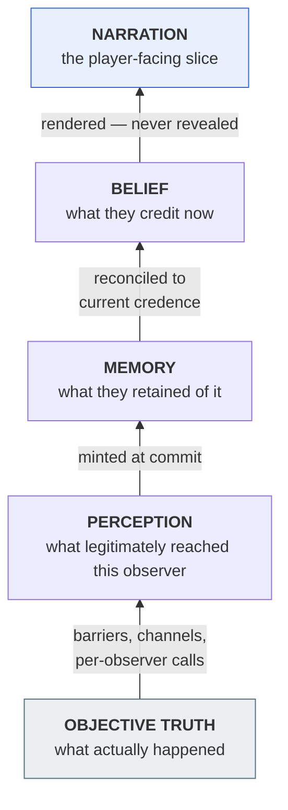
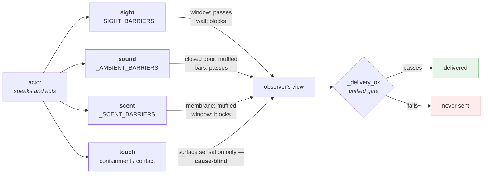
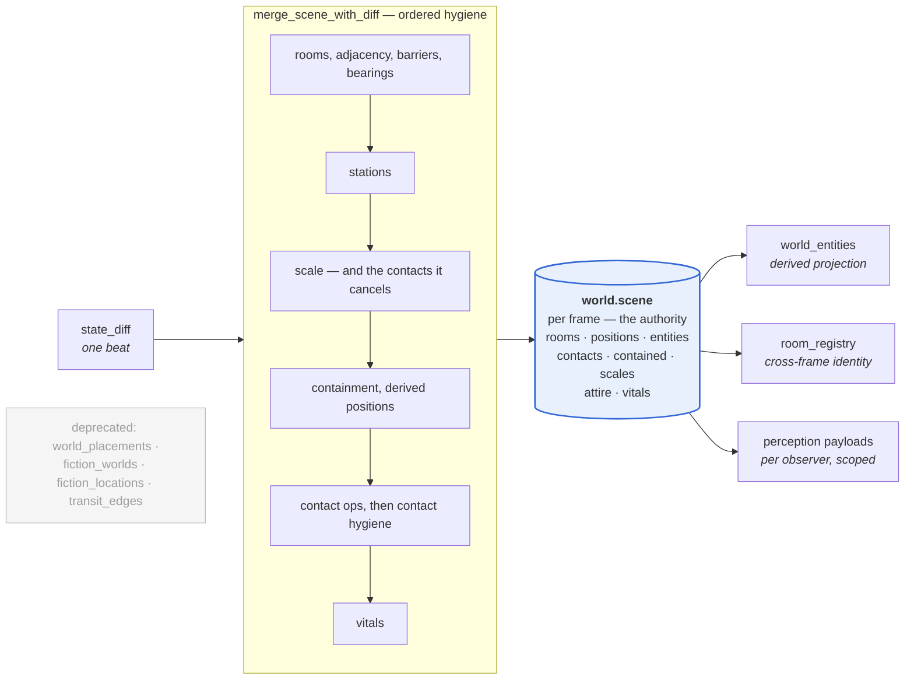
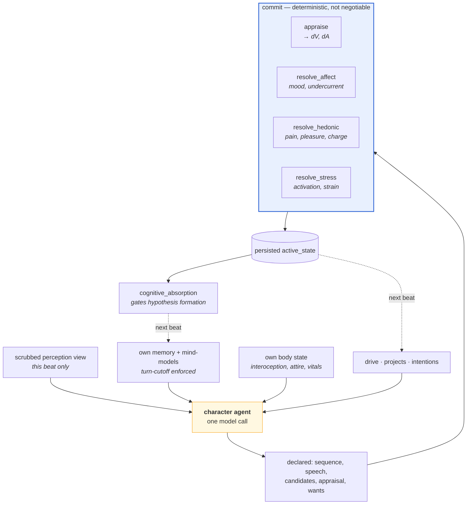
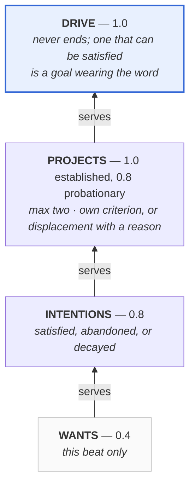
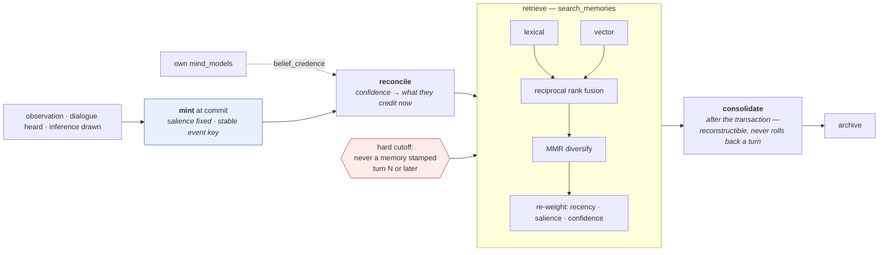
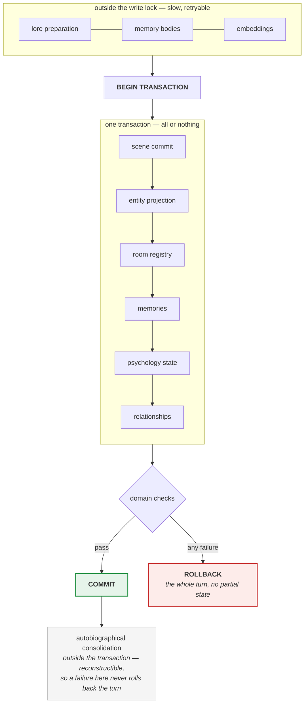

# Sonder Engine — Engineering Reference

How the system actually operates, layer by layer.

This document is the connective tissue between the reference docs. It explains
**mechanism and rationale**; it does not restate their tables. When a fact has
an owner, this file points at it:

| For | Read |
|---|---|
| Which file to edit for which change | [`AGENTS.md`](../AGENTS.md) |
| Exact stage order and payloads | [`PIPELINE.md`](PIPELINE.md) |
| Schema, write helpers, persistence checklist | [`DATABASE.md`](DATABASE.md) |
| Generated symbol/route/table index | [`CODE_MAP.md`](CODE_MAP.md) |
| Test tiers and CI policy | [`TESTING.md`](TESTING.md) |
| Philosophy and conformance status | [`Design.md`](../Design.md) |
| Known defects and unbuilt work | [`UNBUILT.md`](UNBUILT.md) |

> **A note on the diagrams.** They are Mermaid, rendered natively by GitHub and
> by most Markdown viewers. Being source rather than images, they diff, review
> and edit like the rest of the file — when a boundary moves, the diagram moves
> with it in the same commit.

---

## 1. The constraint that shapes everything

Every architectural decision in this engine descends from one rule:

> **No fictional mind may use information it did not legitimately perceive,
> learn, remember, or infer.**

That is harder than it sounds, because the natural way to build an LLM fiction
system — one context containing the world state and the cast, with instructions
about what to ignore — fails silently and constantly. Models do not reliably
ignore what is in front of them, and a leak produces prose that *reads* fine.
Nothing surfaces the error.

So the engine treats objective truth, perception, memory, belief, and narration
as **separate layers that never share a context**. The enforcement is
structural rather than instructional: a character agent is not told to ignore
the Director's event; it is never sent it.

Six consequences run through everything below:

1. **Stages are separate model calls.** Not sections of one prompt.
2. **Perception is per observer.** Two characters in a room get two calls,
   because one call producing two views can leak between them.
3. **Model output is provisional.** `commit.py` decides what becomes true.
4. **Structured output is re-derived, not trusted.** Perception's observation
   objects are rebuilt from its own scrubbed prose, so the second
   representation cannot widen the information budget.
5. **Deterministic backstops sit under model behaviour.** Where a model can
   fail open, a pure function closes it.
6. **The engine reports rather than hides.** Warnings and fidelity checks
   record what looked wrong instead of silently repairing it.

### Diagram 1 — The information layers

Each arrow is a narrowing. Nothing skips a step, and nothing flows back down.



---

## 2. Process and request lifecycle

The application is a single FastAPI process (`app.py`) over one SQLite
database. There is no job queue and no external service: a turn runs inside the
request that submitted it, streaming events back as it goes.

**Submitting a turn.** `POST /api/chats/{id}/turn` does four things in a strict
order, and the order is the concurrency control:

1. Claim the pipeline slot for `(chat_id, frame_id)` — an atomic gate. A
   second concurrent submission gets a 409 rather than a second pipeline.
2. Inside one transaction: allocate the next turn index (chat-global across
   frames), capture a checkpoint, and insert the `turns` row.
3. Run the pipeline, yielding events as a stream.
4. Release the slot in a `finally`, whatever happened.

The slot is claimed **before** the turn row is created, so a losing request
cannot leave a stepless orphan turn blocking the frame. If row creation or
checkpointing fails, the slot is released explicitly.

**Aborting.** Each run registers an abort `Event` in `ABORTS`. `POST
/abort` sets it; the pipeline observes it at stage boundaries, publishes a done
marker, and unwinds. Cancellation is cooperative — the engine never abandons a
partially-written transaction.

---

## 3. The turn pipeline

A turn is a sequence of **stages**, each a model call plus deterministic pre-
and post-processing, executed by `agents/runtime.py` over a `PipelineContext`
(`pipeline_context.py`).

`STEP_HANDLERS` maps a stage key to its handler:

```
interaction_loop   director_establish   mapping_stage    perception_establish
reaction_loop      director_interpret   mapping_quick    perception_act
                   director_resolve     background_react perception_outcome
                                        narrator         narrator_extra    commit
```

plus a dynamic `character:<id>` namespace owned by `character_step`.
`register_step` allows adding a stage without editing dispatch, but plan
construction stays deliberately separate — a new stage must also be placed in
`build_plan` or `establishment_plan`, because *where* it runs is a design
decision, not a registration detail.

**The plan is built per turn, not fixed.** `build_plan` reads
`director_interpret.flow` and decides what the beat needs: whether mapping runs
full or cached, whether contested physical reactions require a reaction loop,
whether characters run in parallel or through a turn-taking interaction loop,
whether a background presence reacts at all.

**Every stage's output is persisted** as a `steps` row plus a `variants` row,
with exactly one active variant per step (`agents/storage.py`). This is not
logging — it is the mechanism that makes reroll, rerun-from-stage, and manual
editing possible, and it is why an author can inspect why a character did
something.

### Diagram 2 — The normal turn

Dashed stages are conditional: the plan is built per beat from
`director_interpret.flow`. In practice `interaction_loop` is the norm, not the
exception — measured across ~1,250 live turns, 1,180 used it and only 2

```mermaid
flowchart LR
    DI["director_interpret<br/><i>interpret + plan</i>"] --> MAP["mapping<br/><i>full or cached</i>"]
    MAP --> PA["perception_act<br/><i>onset, per observer</i>"]
    PA -.->|"contested physical"| RL["reaction_loop"]
    PA --> CH{{"character agents"}}
    RL --> CH
    CH -->|"turn-taking"| IL["interaction_loop"]
    CH -->|"autonomy 0"| PAR["character:id<br/>in parallel"]
    IL --> DR["director_resolve<br/><i>what actually happened</i>"]
    PAR --> DR
    DR -.->|"gated, usually skipped"| BG["background_react"]
    DR --> PO["perception_outcome<br/><i>outcome, per observer</i>"]
    BG --> PO
    PO --> NAR["narrator<br/><i>player-facing slice</i>"]
    NAR --> CM["<b>commit</b><br/><i>the only writer</i>"]

    style CM fill:#e8f0fe,stroke:#3367d6,stroke-width:2px
    style CH fill:#fff8e1,stroke:#f9a825
```

materialised standalone `character:<id>` steps.



Every box above persists a `steps` row and one active `variants` row — which is
what makes reroll, rerun-from-stage and hand-editing possible.

### Diagram 3 — Opening turn vs normal turn

There is no player action to interpret on turn 0 and no prior world to change,
so the world is *established* rather than resolved — and no character acts.

```mermaid
flowchart LR
    subgraph O["OPENING TURN — turn.idx == 0"]
        direction LR
        O1["mapping_stage"] --> O2["director_establish"] --> O3["perception_establish"] --> O4["narrator"] --> O5["commit"]
    end
    subgraph N["NORMAL TURN"]
        direction LR
        N1["director_interpret"] --> N2["mapping"] --> N3["perception_act"] --> N4["characters"] --> N5["director_resolve"] --> N6["perception_outcome"] --> N7["narrator"] --> N8["commit"]
    end
    O -.->|"every turn after"| N

    style O5 fill:#e8f0fe,stroke:#3367d6
    style N8 fill:#e8f0fe,stroke:#3367d6
```



---

## 4. Stage ownership

Each stage owns a question, and owning it means the others must not answer it.
This is the part most easily eroded by a well-meaning change.

**Director** (`agents/director.py`) — objective causality. Interprets the
player's declaration into a structured `sequence`, then later resolves what
actually happened. It is entitled to omniscience because it cannot resolve a
beat it may not see. It must **not** silently replace the player's declared
speech or action, and must not author character psychology or conduct. The
player-side guard is `_check_player_act_authority`; a character-side equivalent
is a known gap ([`UNBUILT.md`](UNBUILT.md) §1.1).

**Perception** (`agents/perception.py`) — a stateless filter deciding what each
observer legitimately receives. Runs twice per beat: once on the action *onset*
and once on the resolved *outcome*, because perceiving an attempt and
perceiving its result are different events. Its structured observations are
re-derived from the final scrubbed prose.

**Character agents** (`agents/character.py`, `agents/loops.py`) — behaviour
declared from private perception, memory, relationships and own-body state.
A character never decides its own success. `psychology_runtime.py` then
persists bounded state from those permitted inputs only.

**Background** (`agents/background.py`) — at most one named, unregistered
presence gets a single stateless reaction per beat, gated deterministically by
`commit.pick_background_reactor`, which returns `None` (no model call) on the
large majority of turns. No memory, no psychology: that requires promotion to a
real character.

**Narrator** (`agents/narration.py`) — renders only the player-facing slice. It
cannot originate player conduct or reveal unperceived facts, and it is required
to render quoted dialogue verbatim.

**Commit** (`commit.py`) — the sole persistence boundary. Detail in §8.

### Diagram 4 — Who may see what

A matrix reads better as a table than as a picture. ● permitted · ◐ partial or
scrubbed · ○ never.

| | World state | Resolved event | Others' interiors | Own memory | Own body | Player declaration |
|---|:--:|:--:|:--:|:--:|:--:|:--:|
| **Director** | ● | ● | ○ | ○ | ● | ● |
| **Perception** | ◐ | ● | ○ | ○ | ○ | ● |
| **Character agent** | ○ | ○ | ○ | ● | ● | ◐ |
| **Background presence** | ○ | ◐ | ○ | ○ | ○ | ◐ |
| **Narrator** | ◐ | ○ | ○ | ○ | ○ | ● |
| **Commit** | ● | ● | ● | ● | ● | ● |

The Director is entitled to omniscience because it cannot resolve a beat it may
not see. A character agent gets its **own** memory and body and nothing else —
the player's declaration reaches it only as a scrubbed perception view, never as
the raw text. Commit sees everything because it is the layer deciding what
becomes true.

---

## 5. How the firewall is actually enforced

Instruction is not enforcement. The mechanisms:

**Per-observer model calls.** `_per_observer_model_views` issues one call per
perceiver with one payload. Two observers cannot leak into each other because
they were never in the same context.

**Input-side hygiene.** Where no perceiver in a call recognises the actor, the
actor's canonical name is not placed in the payload at all — handing it over
with an instruction to ignore it is exactly the pattern the engine forbids.
Same for appearance when no perceiver can see.

**A unified delivery gate.** `agents/common._delivery_ok` consolidates
containment, awareness, sight (including rear-arc), and hearing (with
proximity). Every deterministic delivery site calls it rather than
re-implementing scattered checks.

**Channel-by-channel barriers.** Sight, sound, scent and touch are gated
separately in `spatial.py` — `_SIGHT_BARRIERS`, `_AMBIENT_BARRIERS`,
`_SCENT_BARRIERS`, containment. A window passes sight only; bars pass sight and
sound; a membrane passes passage only. Touch-only perception is deliberately
**cause-blind**: surface sensation crosses, the act producing it does not.

**Output-side scrubs.** Free model prose is checked after generation:
`_scrub_unknown_identities` replaces names an observer has not earned, outside
quoted spans only, and reports what it scrubbed rather than silently fixing it.

**Tripwires.** A character's own speech is scanned against its suppressed wants,
undercurrent and unenacted intentions (`affect.leak_scan`) — an interior leak
becomes a warning.

### Diagram 5 — Perceptual channels and barriers

Each channel is gated by its own barrier table, so one wall can pass sight and
stop scent. The four questions are answered separately and never collapsed.



Touch is deliberately **cause-blind**: a body you can feel but not see delivers
pressure and movement, never the act producing them.

---

## 6. The world model

**Authority is consolidated.** The frame-scoped `world.scene` JSON blob is the
single runtime source of truth for live rooms, positions and entity state.
`room_registry` is the cross-frame ledger of room identity and retirement. The
normalized `world_entities` table is a *derived projection* of the scene
commit. `world_placements` is decommissioned; `fiction_worlds`,
`fiction_locations` and `transit_edges` are deprecated import-compatibility
tables.

Every scene writer must keep the registry projection in sync — check both the
commit path and the restore path before adding one.

**Merging is where hygiene lives.** `spatial.merge_scene_with_diff` deep-copies
the scene and applies a beat's `state_diff` through a fixed order: rooms and
adjacency, barriers, bearings, stations, scale (and the contacts scale
invalidates), containment, derived contained positions, contact ops, contact
hygiene, then vitals. Order is load-bearing. A size change cancels holds
*before* the beat's own contact ops, so a hold re-established at the new size
survives.

**Relations are stored once.** A contact is a relation between two bodies, kept
in `scene.contacts`, never on either body — the older per-entity shape produced
two records that drifted. Contacts are pruned by position change (walking away
ends a hold with nothing for the Director to remember) and by age: a contact
nobody re-asserts across successive beats of contact talk retires, with
momentary acts (`kiss`, `pinch`) retiring a beat sooner than durable states
(`rest`, `press`) and rendering as the touch they left rather than as the act.

**Frames** (`frames.py`, `spatial_frames.py`) give a chat concurrent
timelines — separate scenes, separate memory visibility — sharing one global
play order.

### Diagram 6 — Scene state and its projections

One authority, several read-only projections. Merge order is load-bearing:
scale invalidates contacts *before* the beat's own contact ops, so a hold
re-established at the new size survives.



---

## 7. Character cognition

A character agent is not asked "what do you say?" It is given a bounded private
world and asked what it does; the runtime then persists what deterministically
follows.

**Inputs.** Own sheet (identity, drive, values, traits, voice, interoception),
own body state, own attire, this beat's scrubbed perception view, own recent
lines, own memories, own mind-models of others, relationships, standing
intentions and projects, and the room's visible affordances. Never another
character's interior, never the raw Director event.

**The motivation tiers**, in descending permanence:

| Tier | Weight | Ends when |
|---|---|---|
| `psychology.drive` | 1.0 | never — a drive that can be satisfied is a goal wearing the word |
| `interior.projects` | 1.0 established / 0.8 probationary | own criterion, or displacement with a stated reason |
| `interior.intentions` | 0.8 | satisfied, abandoned, or decayed |
| `active_state.wants` | per-beat | the beat ends |

Cap of two projects. Drive weight is earned by service, never by adoption.

**The deterministic half.** After the model declares behaviour, `commit.py`
resolves state through pure functions:

- `affect.appraise` — OCC-style appraisal of goal impacts into a valence/arousal
  delta, plus intrinsic pleasantness, novelty and somatic terms. A confirmed
  positive impact on a drive whose appetite is still unreleased does **not**
  read as completion.
- `affect.resolve_affect` — decay toward baseline, blend toward the model's
  proposed mood under an inertia clamp, keep the model's label (denial and
  masking are real behaviour), and carry or synthesise an undercurrent.
- `psychology_runtime.resolve_hedonic` — pain and pleasure as fast-decaying
  *levels*, plus `charge`, the slow integral of unresolved appetite that only
  the character's own declared release discharges, plus `sustained_beats`,
  how long a body has been held at a level with nothing new happening.
- `psychology_runtime.resolve_stress` — activation, strain, load, coping mode.
- `psychology_runtime.cognitive_absorption` — how much of the mind its own body
  is claiming, 0..1, **deliberately blind to valence**: intense pleasure
  occupies attention exactly as intense pain does. It habituates across a
  plateau and is reset to full by a peak.

**Absorption is spent, not just recorded.** `theory_of_mind` narrows the
confidence cap on effortful inference, raises the floor a *new* hypothesis must
clear, and shrinks the active hypothesis sheet from five entries to one. It
gates **formation, not reinforcement** — recognising what you already think is
automatic and survives; building a theory is controlled and does not.

### Diagram 7 — One character's beat

The model **declares**; the runtime **resolves**. A character never authors its
own success, and never authors the numbers that govern it next beat.



### Diagram 8 — Motivation tiers

A want `serves` something above it. What a beat's impact is *worth* depends on
which tier it lands on — that weight is exactly what `appraise` multiplies by.



Drive weight is **earned by service, never by adoption** — a newly adopted
project sits at intention weight until it has been served.

---

## 8. Memory and belief

**Minting.** Memories are written at commit from what the character legitimately
had: observation, dialogue heard, inference drawn. Each carries `kind`,
`category`, `salience` (how much it mattered when formed), `confidence` (how
much it is credited now), valence, arousal, entities, provenance, `turn_idx`,
and a stable event key that makes reruns idempotent.

**Salience and confidence are deliberately different.** Salience is fixed at
mint and drives consolidation. Confidence moves.

**Reconciliation.** `reconcile_inference_confidence` re-weights an inference
memory to what the character credits *now*, read from their own `mind_models`.
Two rules make it safe: a claim no live hypothesis carries rests at a fixed
fraction of its mint confidence — *not* a per-turn multiplication, because
`mind_models` is a small working set that prunes on capacity and half-life,
and aging out is not the same as concluding you were wrong; and a claim still
stored never ranks below one that was abandoned. It reads only that character's
own rows and own mind-models: grading a belief against reality would collapse
the belief layer into the truth layer.

**Retrieval.** `search_memories` is hybrid — lexical and vector lists combined
by reciprocal rank fusion, diversified by MMR, re-weighted by recency,
salience and confidence, and hard-filtered so a character deciding turn N never
retrieves a memory stamped turn N or later. Without an embeddings provider
configured it silently falls back to a local hash, and semantic recall degrades
to fuzzy-lexical.

**Consolidation.** Autobiographical summaries are built after the main
transaction, because they are reconstructible: a consolidation failure must
never roll back an otherwise valid turn.

### Diagram 9 — A memory's life

`salience` is fixed at mint and drives consolidation; `confidence` moves and
drives ranking. Keeping them separate is what lets a character recall having
believed something they no longer credit.



An abandoned belief is demoted **once**, to a fixed fraction of its mint
confidence — not multiplied on every pass. Aging out of the working set is not
the same as concluding you were wrong.

---

## 9. Persistence, recovery and history

**One boundary.** Model output is provisional until `commit.py` validates and
persists it. Slow preparation — lore, memory bodies, embeddings — happens
*before* the write lock; then all primary turn mutations commit inside one
outer transaction. Any domain failure rolls the whole turn back. Only
reconstructible work runs afterwards.

**Checkpoints** are captured before a pipeline mutates durable state, in the
same transaction that creates the turn row, so a failure cannot leave a turn
that blocks the frame.

**Branching** clones a chat at a turn, remapping ids across scene, memory,
knowledge and registry. **Archives** (`chat_archive.py`) export and import a
portable chat. **Traces** (`pipeline_trace.py`) export persisted history for
replay, privacy-consciously.

Any new persistent field needs all of it: schema and migration in `db.py`,
read and commit code, archive handling, checkpoint snapshot and restore,
branch/clone id remapping, and a regression test. The checklist is in
[`DATABASE.md`](DATABASE.md) and it is not optional — a field that survives
play but not a branch is a bug that appears weeks later.

### Diagram 10 — Commit transaction lifecycle

Slow provider work happens *before* the write lock; every primary mutation
lands inside one transaction; only reconstructible work runs after it.



---

## 10. Talking to models

`providers.py` owns provider connections, streaming, retries, timeouts and
embeddings. Routing is per role, so the Director and the character agents can
sit on different models — a measured, meaningful split.

`schemas.py` defines accepted output. Every model inherits `LenientModel`,
which accepts a structured value where a field is declared `str` and reduces it
to the prose inside; five separate crashes were this one shape, each discarding
an entire stage output. It fires *only* on a `str`-typed field receiving a
dict or list, so it cannot mask a real type error.

Validation runs strictly inside the generation call with a bounded repair loop,
then again warning-only afterwards. A stage that cannot produce valid output
raises rather than silently substituting.

`prompt_cache.py` places cache breakpoints so the stable prefix of a prompt is
reused.

---

## 11. Frontend

`static/js/` uses **browser globals, not ES modules**. `theme-init.js` loads in
the head; the rest load in a fixed order:

```
utils.js → components.js → editors.js → lorebooks.js → backdrops.js
        → chat.js → settings.js → themes.js → app.js
```

Renaming a shared function without grepping every file will break it silently.

---

## 12. Failure behaviour

The engine's stance is that a wrong beat reported is better than a wrong beat
hidden.

- **Warnings** accumulate on the context and persist with the turn.
- **Fidelity checks** compare narrator prose against the view it was given —
  dropped dialogue, invented player conduct, third-person slips, contradicted
  portal states. Only unambiguous classes are *enforceable* (worth spending a
  rewrite on); the rest are recorded for review.
- **Deterministic backstops** inject what a model omitted — a declared act
  missing from a view is appended rather than lost.
- **Repetition screens** catch a character reissuing its own line verbatim, or
  reusing one sentence shape across many beats, and buy one rewrite.

A recurring lesson, visible throughout the changelog: **fix the earliest stage
where data first becomes wrong.** Compensating downstream — especially in the
Narrator — hides the defect and creates a second one.

---

## 13. Working on it

```bash
make check      # compile + map freshness + structure + full tests
make check-fast # the same, minus database-backed slow tests
```

`make check` treats a stale `CODE_MAP.md`, a duplicated top-level symbol, or
leftover patch-debris markers as hard failures. Reproduce a bug with a focused
test before fixing it. Avoid broad rewrites of `agents/runtime.py`, `app.py` or
`memory.py` without dedicated tests — they are orchestration seams affecting
reruns, variants, streaming and commits.

Psychology changes carry a specific warning worth repeating: an unfilled field
does not error, does not warn, and does not appear in any test. It appears as a
character who behaves wrongly fifty beats later, by which time the cause looks
like a model problem. See the authoring notes in
[`CLAUDE.md`](../CLAUDE.md) and [`DESIGN_PSYCHOLOGY_AS_PRESSURE.md`](DESIGN_PSYCHOLOGY_AS_PRESSURE.md).

---

## Diagram index

All Mermaid except #4, which is a permission matrix and reads better as a table.

| # | Subject | Section |
|---|---|---|
| 1 | The information layers | §1 |
| 2 | The normal turn | §3 |
| 3 | Opening turn vs normal turn | §3 |
| 4 | Who may see what _(table)_ | §4 |
| 5 | Perceptual channels and barriers | §5 |
| 6 | Scene state and its projections | §6 |
| 7 | One character's beat | §7 |
| 8 | Motivation tiers | §7 |
| 9 | A memory's life | §8 |
| 10 | Commit transaction lifecycle | §9 |
